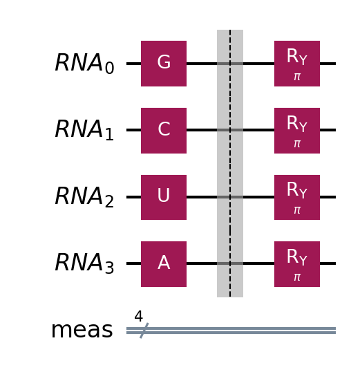

# RNA to DNA using quantum circuits

This is a simple circuit to transcribe a RNA to a DNA using quantum computing

## How it works?

the bases are encoding in two different quantum basis in the Bloch sphere

$C$ and $G$ are encoded in the computational basis using the $X$ gate, while the $A$ and $U$ are encoded in the Hadamard basis using the $H$ gate.

With this protocol, we insert the RNA as gates, then we rotate by $\pi$ using the $RY$ to get the relative base for the DNA.



After that, we have encoded values in two different basis. To get the relative DNA bases, are used measurements on both $Z$ and $X$, and the values are pos-processed by a classical algorithm.

## How to use?

To check the project out, you may need to install some dependencies by running:

```bash
pip install -r requirements.txt

# or with conda

conda deactivate
conda env create -f environment.yml
conda activate dna-quantum
```

Then, you can check the [example.ipynb](./example.ipynb) or the functions source code at [transcode.py](./transcode.py).  